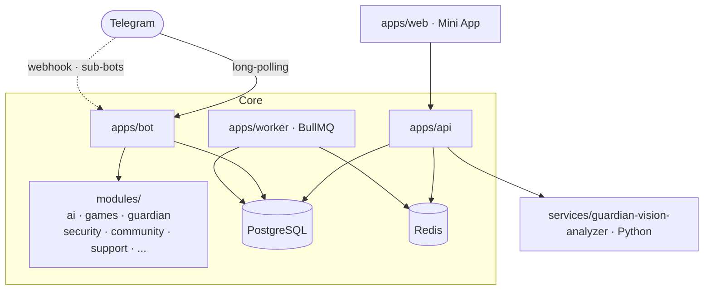

<div align="center">

# 🤖 Modryva

### El bot de Telegram **todo-en-uno** para comunidades que quieren crecer

**Modera · Verifica · Entretiene · Monetiza** — autoalojable, modular y de código abierto.

[](LICENSE)


</div>

---

> **Un solo bot en lugar de cinco.** Modryva reúne moderación seria, verificación de acceso
> antibots, juegos y casino social, chat con IA y Mini Apps nativas de Telegram en un
> monorepo TypeScript de grado producción — el que despliegas tú, en tu servidor, con tus datos.

## ✨ Por qué Modryva

- 🧩 **Todo-en-uno.** Deja de encadenar un bot de moderación + uno de bienvenida + uno de juegos + uno de captcha. Modryva lo hace todo, coherente y bajo un mismo panel.
- 🔒 **Tus datos, tu servidor.** Autoalojable de principio a fin. Sin SaaS obligatorio, sin límites de plan, sin ceder la moderación de tu comunidad a un tercero.
- 🧠 **Inteligente de verdad.** IA con memoria, verificación con visión artificial y economía de juego *provably-fair* — no simples respuestas enlatadas.
- 🏗️ **Arquitectura de producto, no de prototipo.** Monolito modular, TypeScript estricto, migraciones versionadas, CI que reconstruye la base desde cero y tests de integración contra Postgres real.
- 🤝 **Convive con lo que ya usas.** Modo pasivo y modo no-admin para coexistir con otros bots sin pisarse.

## 🎯 Funciones de un vistazo

| Área | Lo que hace |
|---|---|
| 🛡️ **Moderación** | Filtros, notas, anti-raid, moderación de **reacciones**, auditoría, limpieza |
| ✅ **Guardian** | Verificación de acceso por foto + edad + **liveness** con visión artificial |
| 🎮 **Juegos & Casino** | 10 juegos de mesa, fichas *provably-fair*, torneos y **Telegram Stars** |
| 🤖 **IA** | Chat por mención con **memoria**, multi-proveedor y redacción de secretos |
| 🧩 **Mini Apps** | Panel web nativo de Telegram (tema claro/oscuro) para config y juegos |
| 🏗️ **Plataforma** | Bot padre que crea y **gestiona sub-bots** para otros grupos |
| 🎉 **Engagement** | Bienvenidas con botones, leaderboards, rituales y recaps con IA |

---

## 🛡️ Moderación que no miente

Moderación honesta: Modryva **solo dice que hizo algo si de verdad lo hizo** (todo queda en el log de auditoría).

- **Filtros y notas** — respuestas automáticas por *trigger* y notas guardadas por chat.
- **Moderación de reacciones** — retira reacciones vetadas en cuanto aparecen (Bot API 10.0 `deleteMessageReaction`), con auditoría del actor.
- **Anti-raid y ventanas estrictas** — frena entradas masivas y avalanchas de mensajes.
- **Auditoría completa** — cada acción de moderación queda registrada y es consultable.
- **Modo pasivo** — hazlo convivir con GroupHelp/Rose/otros: Modryva se limita a verificación + juegos y no toca la moderación del otro bot.
- **Modo no-admin** — aunque no sea administrador, vigila y **avisa** a los admins de lo que ve.

## ✅ Guardian — verificación de acceso con visión artificial

El portero antibots más serio que puedes autoalojar. Nadie entra sin pasar el filtro que **tú** configures.

<details>
<summary><b>Ver el detalle de verificación</b></summary>

- **Foto → clasificación** — verifica al usuario por foto y lo enruta (p. ej. a STAFF).
- **Edad autodeclarada + tope** — pregunta la edad y aplica un límite configurable.
- **Liveness real** — un microservicio Python (`services/guardian-vision-analyzer`) detecta **parpadeo, sonrisa, gesto de mano y pose de cabeza** para distinguir a una persona de una foto estática.
- **Juez de visión con IA** — evaluación opcional por IA (interruptor independiente `GUARDIAN_VISION_JUDGE_ENABLED`).
- **Doble verificación y país** — capas extra para comunidades sensibles.
- **Sesiones firmadas** — cada verificación es una sesión con su propio secreto, sin exponer datos.

</details>

## 🎮 Juegos y casino social

Convierte tu grupo en un sitio al que la gente **quiere volver cada día**.

- **10 juegos de mesa** — del blackjack al keno, jugables en el chat **y** en una Mini App de mesa.
- **Economía de fichas *provably-fair*** — resultados verificables criptográficamente; nada de "confía en mí".
- **Telegram Stars** — monetización nativa integrada.
- **Torneos y clasificaciones** — leaderboards con nombre real, no con ID.
- 🗺️ *En camino:* jackpot progresivo, clanes, referidos y side-betting.

## 🤖 Inteligencia artificial con memoria

Una IA que **recuerda** a tu comunidad, no un loro sin contexto.

- **Chat por mención** — responde cuando la mencionan (`@ModryvaBot ¿qué tal?`), sin comandos.
- **Memoria explícita** — «*Modryva recuerda que…*» al estilo ChatGPT/Gemini, con `/memoria`, `/olvida` y `/olvidatodo`.
- **Multi-proveedor con failover** — Groq · Gemini · OpenRouter, con **rotación de claves** y *cooldown* automático.
- **Redacción de secretos** — sanea los prompts y **tacha** tokens/claves antes de enviarlos (`SECRET_PATTERNS`).
- **Modo privacidad** — control sobre qué se procesa.

## 🧩 Mini Apps nativas de Telegram

Toda la potencia también en una interfaz web que se siente **parte de Telegram**.

- **Panel de configuración** con tema claro/oscuro y tokens de diseño nativos.
- **Dashboards de insight**, notas de staff, tickets y panel personalizable.
- **Mesa de juegos** jugable desde la propia Mini App.

## 🏗️ Plataforma de sub-bots

Modryva no es solo un bot: es una **fábrica de bots**.

- Un **bot padre** concede acceso y **crea/gestiona bots hijos** para otras comunidades.
- El padre corre por *long-polling*; los hijos se sirven por **webhook**.
- Los tokens de los bots hijos se almacenan **cifrados**.

## 🎉 Engagement y bienvenida

- **Bienvenidas ricas** — foto + botones inline (reglas en popup/URL, contactar admins, abrir la Mini App).
- **Rituales y recaps** — resúmenes semanales generados con IA.
- **Leaderboards** que reconocen a tus miembros más activos por su nombre.

---

## 🏛️ Arquitectura

Monolito modular en un monorepo **pnpm + Turborepo**. Procesos desplegables (`apps/`),
librerías transversales (`packages/`) y features de dominio (`modules/`), todos sobre un
único esquema de datos.



```
apps/        bot · api · web · worker         (procesos)
packages/    domain · data · telegram · auth · shared   (librerías)
modules/     ai · automation · community · core · files · games · payments · security · support
services/    guardian-vision-analyzer          (microservicio de visión, Python)
```

## 🧰 Stack

**TypeScript** estricto · **NestJS** + **Fastify** · **Next.js 15** + **React 19** ·
**Prisma 6** + **PostgreSQL 16** · **Redis** + **BullMQ** · **Vitest** · **Biome** ·
**pnpm 11** · **Node 24** · microservicio de visión en **Python**.

## 🚀 Arranque rápido

Requisitos: **Node ≥ 24**, **pnpm ≥ 11** y Docker (para Postgres + Redis).

```bash
pnpm install
cp .env.example .env          # rellena tus valores (ver Configuración)
docker compose up -d postgres redis
pnpm db:generate
pnpm db:deploy                # aplica las migraciones sobre una base limpia
pnpm dev
```

| Servicio | URL local |
|---|---|
| 🤖 Bot | http://localhost:3002 |
| 🔌 API | http://localhost:3001 |
| 🖥️ Web (Mini App) | http://localhost:3003 |
| ⚙️ Worker | http://localhost:3004 |

¿No tienes bot todavía? Crea el tuyo con [@BotFather](https://t.me/BotFather) siguiendo [`docs/BOTFATHER.md`](docs/BOTFATHER.md).

## ⚙️ Configuración

Todo se configura por variables de entorno. Copia `.env.example` a `.env` y, como mínimo, define:

| Variable | Para qué |
|---|---|
| `DATABASE_URL` | Conexión a PostgreSQL |
| `REDIS_URL` | Conexión a Redis |
| `TELEGRAM_BOT_TOKEN` | Token de tu bot ([@BotFather](https://t.me/BotFather)) |
| `TELEGRAM_WEBHOOK_SECRET`, `SESSION_SECRET` | Secretos que generas tú |
| `AI_*` | Claves de IA (Groq/Gemini/OpenRouter) — opcionales |

`.env.example` documenta el conjunto completo. **Nunca** commitees tu `.env` real.

## 🧪 Calidad

```bash
pnpm lint         # Biome + lint de copy
pnpm typecheck    # tsc --noEmit en todos los workspaces
pnpm test         # Vitest
pnpm build
```

La CI ([`.github/workflows/ci.yml`](.github/workflows/ci.yml)) además **reconstruye el esquema desde cero**,
verifica que las migraciones cubren el schema (sin drift de `db push`) y corre los **tests de integración
contra un Postgres real**.

## 📚 Documentación

- [`docs/ARCHITECTURE.md`](docs/ARCHITECTURE.md) — arquitectura y decisiones base.
- [`docs/DEVELOPMENT.md`](docs/DEVELOPMENT.md) — comandos, pnpm, Docker y notas de entorno.
- [`docs/COMMANDS.md`](docs/COMMANDS.md) — referencia de comandos del bot.
- [`docs/BOTFATHER.md`](docs/BOTFATHER.md) — crear y registrar tu bot.
- `docs/Modryva-Vault/` — base de conocimiento interlazada (arquitectura, módulos, datos, API, workflows). Óptima con [Obsidian](https://obsidian.md), pero es Markdown estándar.

## 🗺️ Roadmap

- [ ] Jackpot progresivo, clanes y referidos en el casino
- [ ] Más superficies de configuración en la Mini App
- [ ] Portada con capturas y GIFs de demo
- [ ] Guías de despliegue para 1-click self-hosting

## 🤝 Contribuir

Los PRs son bienvenidos. Lee [`CONTRIBUTING.md`](CONTRIBUTING.md): todo cambio pasa lint + typecheck + test,
y cada cambio de esquema viaja con su migración.

## 🔐 Seguridad

¿Encontraste una vulnerabilidad? **No abras un issue público** — sigue [`SECURITY.md`](SECURITY.md).

## 📄 Licencia

[**AGPL-3.0**](LICENSE). Puedes usar, estudiar, modificar y redistribuir Modryva; si lo ofreces como
servicio en red, debes poner el código fuente de tu versión —con tus cambios— a disposición de los usuarios.

<div align="center">

**Modryva** — hecho para comunidades que se toman en serio a su gente.
© 2026 Gerard Alvear y los contribuidores de Modryva.

</div>
