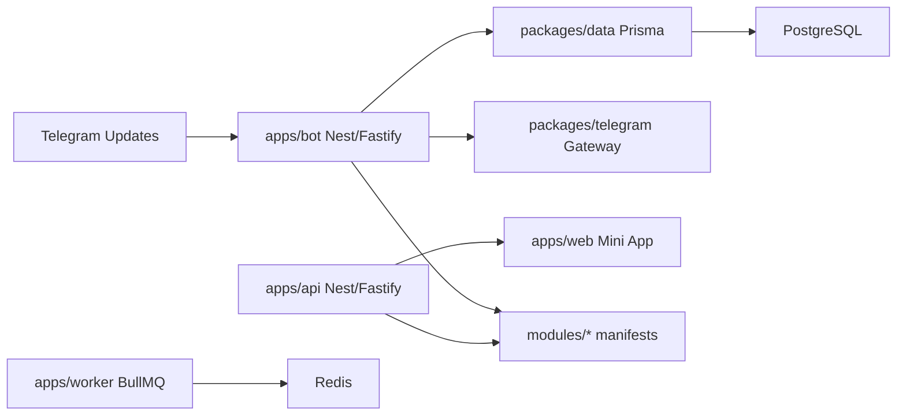

# Arquitectura

## Fase 0 Implementada

La base actual es un modular monolith en TypeScript con limites claros:

- `apps/bot`: entrada Telegram por webhook con NestJS sobre Fastify.
- `apps/api`: API interna para Mini App y bootstrap con NestJS sobre Fastify.
- `apps/web`: Mini App/panel con Next.js y React.
- `apps/worker`: proceso separado para colas y trabajos largos.
- `packages/domain`: contratos puros de dominio.
- `packages/data`: Prisma Client, schema y repositorios.
- `packages/telegram`: normalizacion, parsing y Telegram Gateway.
- `packages/auth`: RBAC y policy primitives.
- `packages/shared`: entorno, logging y utilidades.
- `modules/core` y `modules/security`: primeros manifiestos modulares.

## Flujo De Updates

1. `POST /telegram/webhook/:botUsername` recibe el update.
2. Se valida `X-Telegram-Bot-Api-Secret-Token` si `TELEGRAM_WEBHOOK_SECRET` existe.
3. `normalizeUpdate` convierte el payload en un envelope comun.
4. `PrismaFoundationRepository.ensureContext` crea o actualiza tenant, bot, chat, user y membership.
5. `claimUpdate` deduplica por `botKey + updateId` en `update_inbox`.
6. Se audita `telegram.update.received` o `telegram.update.duplicate`.
7. El modulo core responde a `/start`, `/help`, `/menu`, `/settings`, `/status` y `/cancel`.
8. Toda salida a Telegram pasa por `HttpTelegramGateway`.

## Persistencia Base

El schema Prisma cubre foundation y tablas de control para fases posteriores:

- Tenancy: `tenants`, `managed_bots`, `users`, `chats`, `memberships`, `topics`.
- Control: `roles`, `permissions`, `role_bindings`, `feature_flags`, `module_states`.
- Ingesta: `update_inbox`, `callback_inbox`, `idempotency_keys`, `job_outbox`.
- Seguridad/auditoria: `audit_logs`, `security_alerts`, `secrets_refs`, `privacy_requests`, `backups`.
- Fase 1 preparada: casos, sanciones, warnings, appeals, captcha, spam profiles y reglas.
- Fase 1.1 activa: `ModerationCase`, `Warning` y `Sanction` se crean desde comandos persistentes.

## Seguridad

- El token secreto de webhook es obligatorio en produccion.
- El menu visible no concede permisos; la autorizacion debe validarse en backend.
- Los updates se procesan de forma idempotente por bot.
- Las acciones se auditan con actor, recurso y payload normalizado.
- `packages/auth` mantiene el RBAC minimo para owner/admin/moderator/member/guest/system.
- `SUPERBOT_OWNER_TELEGRAM_ID` permite designar un propietario inicial mientras se completa la gestion avanzada de roles.

## Moderacion Fase 1.1

El modulo `security` ya parsea:

- `/warn <telegram_user_id> [motivo]`
- `/ban <telegram_user_id> [motivo]`
- `/mute <telegram_user_id> <duracion: 10m|2h|7d> [motivo]`

El bot valida `moderation.write`, persiste caso y warning/sancion, audita la accion y responde en Telegram mediante el Gateway central.
Para `ban` y `mute`, el Gateway ejecuta `banChatMember` o `restrictChatMember`; si Telegram falla, el caso permanece persistido y el resultado queda en auditoria para reintentos futuros.

## Mini App

`apps/api` expone:

- `GET /v1/bootstrap`
- `GET /v1/modules`
- `POST /v1/init-data/verify`

La validacion de `initData` usa HMAC segun el contrato de Telegram Web Apps y esta cubierta por tests.
