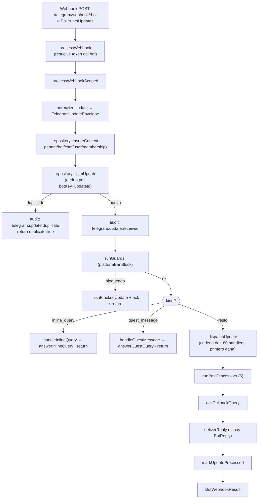

# Bot Pipeline

Cómo se procesa **un update de Telegram** de principio a fin. La entrada es siempre la misma
(`BotUpdateService.processWebhook`), venga del webhook o del [[Poller]], así que idempotencia, auditoría y
persistencia se comportan idéntico en ambos casos.

## Contratos de la pipeline

`apps/bot/src/pipeline.ts` define las piezas reutilizables:

- **`BotHandlerInput`** — `{ context, update, rawUpdate, botUsername, replyBotUsername, miniAppLink }`.
- **`BotUpdateHandler`** — `{ name, handle(input) → BotReply | null }`. La cadena de handlers se recorre en
  orden y el **primero que devuelve una `BotReply` gana** (`dispatchUpdate`, `bot-update.service.ts:1084`).
- **`BotPostProcessor`** — `{ name, run(input) }`. Efectos secundarios que corren **siempre** tras el
  dispatch (XP, actividad, gamificación, automatizaciones).
- **`BotGuardDecision`** — permite bloquear un update antes de la cadena (p. ej. ban de plataforma).

## Flujo

## Notas de diseño

- **Inline Mode** y **Guest Chat Mode** cortan la pipeline en seco: responden por sus propios métodos
  (`answerInlineQuery` / `answerGuestQuery`), sin handlers regulares, sin post-procesadores y sin
  `deliverReply` (`bot-update.service.ts:1007-1033`).
- Los post-procesadores corren **aunque ningún handler haya respondido** (analytics/reputación siempre).
- La entrega concreta (editar vs enviar vs dado) la decide [[Delivery]].

La cadena de handlers y los post-procesadores viven todos dentro del God Object; ver [[Bot Update Service]]
para el listado y [[Update Lifecycle]] para el detalle paso a paso.

## Relaciones

- Pertenece a: [[Bot Core Map]]
- Depende de: [[Package telegram]], [[Package data]], [[Package domain]]
- Utilizado por: [[App bot]], [[Poller]]
- Relacionado con: [[Bot Update Service]], [[Update Lifecycle]], [[Delivery]], [[Core Handlers]]
