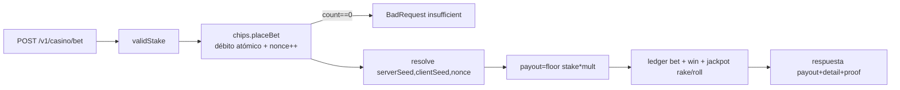
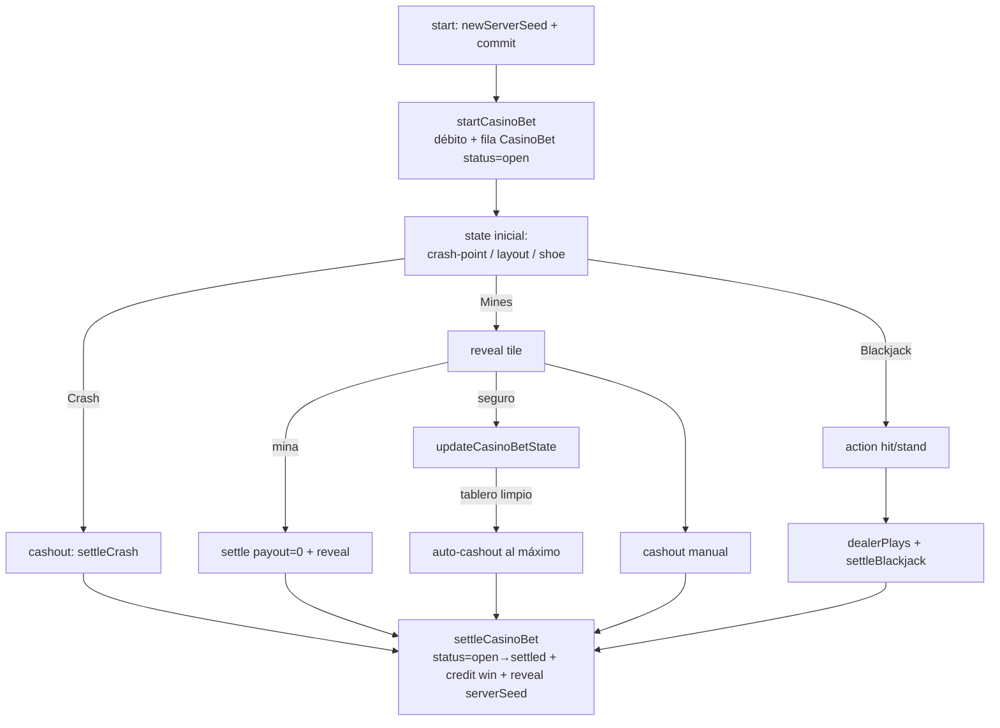

# Casino Bet Lifecycle

Hay **tres** ciclos de vida de apuesta según cómo se genera y cuándo se conoce el resultado.

## 1. Instantáneo (`placeBet`)

Un solo `$transaction`: débito atómico + resolver puro + crédito. Usado por Dado, Plinko, Ruleta, SicBo, Baccarat, Keno, HiLo en la Mini App (`casino.service.ts:98-141`, `instantResolver` L216-301) y por `/dado` nativo (`bot-update.service.ts:2734-2741`).

El resultado se conoce **al instante** porque la semilla del monedero ya existe; el commit se puede verificar después de rotar la semilla. Ver [[Chip Economy]].

## 2. Multi-paso (`startCasinoBet` → … → `settleCasinoBet`)

Para Crash, Mines y Blackjack: el resultado se compromete (sha256) **al empezar** y el `serverSeed` se **revela** al liquidar. Persiste un `CasinoBet` con `state` JSON (`chip-repository.ts:900-1018`, [[Modelo CasinoBet]]).

Invariantes clave:
- **One-settle-per-bet**: `settleCasinoBet` solo liquida si `status==='open'` (`chip-repository.ts:991-998`); una segunda liquidación no re-paga.
- **loadBet** rechaza bets ajenas o cerradas (`casino.service.ts:340-349`).
- **updateCasinoBetState** solo toca bets `open` del propio usuario (L969-979).
- Reentrancy en front: guards `busy`/`settling`/`revealing` + settle de bet huérfana en unmount (ver [[Juego Crash]], [[Juego Mines]]).

## 3. Nativo con dado externo (`debit` → `sendDice` → `credit`)

Slotstorm/Over-Under/Bullseye (`settleNativeBet`, `bot-update.service.ts:2770-2850`): débito atómico → se lanza el dado animado real de Telegram y se lee su `value` → precio con el resolver puro → crédito. Si `sendDice` falla, se **reembolsa** (razón `refund`). El Duelo PvP tiene su propio ciclo `openDuel`→`claimDuel`→`settleDuel` (ver [[Juego Dice Duel]]).

## Relaciones

- Pertenece a: [[Módulo games]]
- Depende de: [[Chip Economy]] (`placeBet`, `startCasinoBet`, `settleCasinoBet`, `debit`, `credit`), [[Provably Fair]]
- Utilizado por: [[Servicio casino]], [[Comando casino]]
- Produce: [[Modelo CasinoBet]], filas de `ChipLedger`
- Relacionado con: [[Juego Crash]], [[Juego Mines]], [[Juego Blackjack]]
