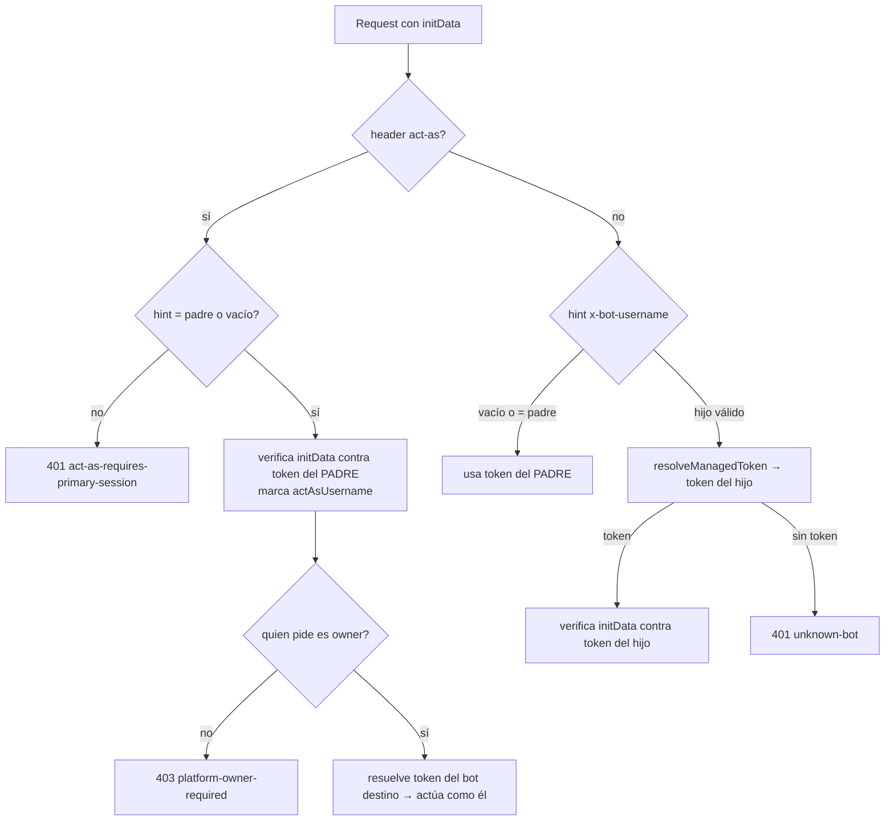

# Bot Scoping

Cómo cada petición de la Mini App se resuelve al **bot y tenant correctos** cuando hay muchos bots hijos
sirviendo desde el mismo backend. Toda la lógica vive en el **[[Guard InitData]]**
(`apps/api/src/miniapp/init-data.guard.ts`), que corre antes de [[Controller platform]] y del resto de
controllers `v1/miniapp/*`.

## Idea central: el HMAC es la prueba de identidad

La Mini App manda `Authorization: tma <initData>`. El `initData` está firmado con HMAC usando **el token
del bot que lo generó**. El guard, según las cabeceras, decide **contra qué token** verificar el HMAC:
solo el token de ese bot produce un hash válido, así que una cabecera no confiable no se puede falsificar
(`init-data.guard.ts:62`–`:73`).

## Cabeceras que la web envía

En `apps/web/lib/api.ts:85`–`:95`:
- `X-Bot-Username: <hijo>` — cuando existe el sticky param `?tgbot=` (`getBotUsername`,
  `apps/web/lib/telegram.ts:155`). Lo pone el menu button del hijo al activarse (ver [[Managed Bots]]).
- `X-Platform-Act-As-Bot-Username: <bot>` — cuando existe `?actas=` (`getActAsBotUsername`,
  `telegram.ts:159`). Es **excluyente** con `x-bot-username`; solo lo usa el owner para "actuar como" otro bot.

## Resolución en el guard (`resolveVerificationBot`, `:162`)

Tras verificar el HMAC (`verifyTelegramInitData`), el guard adjunta el `MiniappContext`
(`init-data.guard.ts:146`): `userId`, `user`, `startParam`, **`botUsername`**, **`botToken`** (descifrado,
nunca se loguea ni serializa) y, si aplica, `platformActAs.sourceBotUsername`. Los controllers leen ese
contexto con `getMiniappContext(req)` y usan `botUsername` para elegir el tenant y `botToken` para llamadas
a Telegram en nombre de ese bot.

## "Act as" (owner)

`x-platform-act-as-bot-username` solo lo permite el owner: `canPlatformActAs` (`:237`) exige
`SUPERBOT_OWNER_TELEGRAM_ID` o rol `platform_owner`. Requiere sesión del **bot padre** (si el `hint` no es
el padre → 401 `act-as-requires-primary-session`). Es lo que permite al owner enviar/configurar como
cualquier bot hijo desde la [[Pantalla platform]] (ej. `configHref` añade `&actas=<bot>`).

## Endurecimiento anti-enumeración (`resolveManagedToken`, `:277`)

Como la cabecera `X-Bot-Username` llega **antes** de verificar el HMAC, se protege el lookup de tokens:
- **Caché** con TTL corto: 5 s para aciertos, 10 s para "no existe" (`TOKEN_CACHE_TTL_MS`/`TOKEN_MISS_TTL_MS`,
  `:47`,`:50`). Un hijo suspendido/caducado deja de resolver token en pocos segundos.
- **Tope FIFO** de 5000 entradas (`MAX_TOKEN_CACHE_ENTRIES`, `:54`) para que un flood de usernames distintos
  no infle el Map.
- **Token bucket** global de *misses* (capacidad 60, refill 30/s, `:59`–`:60`): un flood que falla siempre
  se corta sin tocar la BD (fail-closed → `unknown-bot`). Un fallo transitorio de BD → 503
  `bot-token-unavailable`, no negative-cache.

## Relaciones

- Pertenece a: [[Modryva Hub Overview]]
- Depende de: [[Package data]], [[Guard InitData]]
- Consume: [[Managed Bots]], [[Webhook de Bots Hijos]]
- Utilizado por: [[Controller platform]], [[Pantalla platform]]
- Relacionado con: [[Platform User Ban]], [[Modryva Hub Map]]
