# Managed Bots

Ciclo de vida de los **bots hijos** ("managed bots") del [[Modryva Hub Overview]]: cómo se registran,
activan, cifran su token, se pausan por caducidad y se reactivan. La fila de BD es [[Modelo ManagedBot]];
los estados, [[Enum ManagedBotStatus]].

## 1. Detección del bot hijo

`/createbot` solo instruye al usuario (parseo en `modules/core/src/platform.ts:132`). La creación real se
dispara cuando Telegram envía un update **`managed_bot`** (o `message.managed_bot_created`), normalizado a
`ManagedBotContext { ownerUserId, botUserId, username, firstName }`
(`packages/telegram/src/normalize.ts:423`, `packages/domain/src/update.ts:137`). Eso entra en
`handleManagedBotUpdate` (`apps/bot/src/bot-update.service.ts:4250`).

## 2. Registro (consume el slot)

`registerManagedBot` (`packages/data/src/platform-repository.ts:824`) corre en una transacción:
- Busca un [[Modelo Entitlement]] `managed_bot_slot` activo con `usedQuantity < quantity`.
- Sin slot → `{ ok: false, reason: "no-slot" }` (el bot avisa al owner de canjear un código).
- Con slot: incrementa `usedQuantity` atómicamente (`updateMany ... increment`), hace `upsert` de un
  `Tenant` con slug `telegram-<username>` y crea/actualiza el `ManagedBot` en estado **`pending`**.

## 3. Activación

En `handleManagedBotUpdate` (`:4301`–`:4344`):
1. `getManagedBotToken({ userId: botUserId, token: TELEGRAM_BOT_TOKEN })` — obtiene el token del hijo
   usando el token del **padre** (gateway de Telegram).
2. `generateWebhookSecret()` (32 bytes base64url).
3. Comprueba que la URL base (`TELEGRAM_WEBHOOK_BASE_URL` ?? `TELEGRAM_APP_URL`) sea **https** (si no,
   lanza `managed-bot-webhook-url-must-be-https`).
4. `setWebhook` del hijo → `<base>/telegram/webhook/<username>` con `allowedUpdates` =
   `managedBotAllowedUpdates()` (message, edited_message, callback_query, chat_member, my_chat_member,
   chat_join_request, pre_checkout_query).
5. `activateManagedBot` (`platform-repository.ts:926`) — guarda `encryptedToken`, `tokenFingerprint`,
   `webhookSecretHash`, marca `status = active`, `lastActivatedAt`.
6. **Best-effort:** `setChatMenuButton` del hijo apuntando a `<appUrl>?tgbot=<username>` para que su Mini
   App mande `X-Bot-Username` (ver [[Bot Scoping]]). Un fallo aquí no revierte la activación.
7. Audita `platform.managed_bot.activated`.

Cualquier error en el bloque → `markManagedBotFailed(botUserId, error)` (`:953`) deja `status = failed` y
`lastError`, y avisa al owner.

## 4. Cifrado del token (AES-256-GCM)

En `packages/data/src/platform-repository.ts`:
- `deriveTokenKey(key)` (`:370`) = `sha256("managed-bot-token:" + MANAGED_BOT_TOKEN_KEY)` → clave de 32 bytes.
- `encryptManagedBotToken` (`:373`) — IV aleatorio de 12 bytes, formato de salida
  `v1.<iv>.<authTag>.<ciphertext>` (todo base64url).
- `decryptManagedBotToken` (`:384`) — valida versión `v1` y verifica el auth tag GCM.
- `tokenFingerprint` (`:359`) = `sha256("managed-token:" + token)` (huella no reversible para comparar sin descifrar).
- `getManagedBotToken(username)` (`:963`) — **solo** descifra si el bot está `active` y **no** es primary;
  si falta `MANAGED_BOT_TOKEN_KEY` lanza `missing-managed-bot-token-key`.

`MANAGED_BOT_TOKEN_KEY` es opcional en el entorno pero con mínimo 16 chars (`packages/shared/src/env.ts:88`).
Sin ella no se pueden activar ni servir bots hijos.

## 5. Caducidad y pausa (worker)

El job `managedbot.expire` (`processExpiredManagedBots`, `apps/worker/src/expiration-processor.ts:306`):
1. **Avisa** (una vez) a owners cuyo acceso caduca pronto — DM **desde el bot padre**
   (`listBotsExpiringSoon` + `markExpiryWarned`).
2. **Apaga** los bots cuyo entitlement caducó o fue revocado (`listExpiredActiveBots`): obtiene el token
   *mientras sigue activo*, hace `deleteWebhook`, `suspendManagedBot(id, "entitlement expired")`
   (`platform-repository.ts:1093`, `status = suspended`) y avisa al owner de cómo reactivar. Idempotente.

## 6. Reactivación

La lleva a cabo [[Controller platform]] (`POST mybots/reactivate`) con `reactivationInfo` +
`commitReactivation` (`platform-repository.ts:1103`, `:1151`). Reusa el token cifrado ya guardado, re-setea
webhook con un secreto nuevo y consume un slot solo si el entitlement original ya no está activo.

## Diagrama de estados

```mermaid
stateDiagram-v2
    [*] --> pending: registerManagedBot (consume slot)
    pending --> active: activateManagedBot (setWebhook OK)
    pending --> failed: error en activación
    active --> suspended: caducidad/revocación (worker) o setWebhook fallido
    suspended --> active: mybots/reactivate (commitReactivation)
    failed --> pending: reintento de creación
    active --> revoked: (estado declarado; revocación administrativa)
```

> `revoked` está en [[Enum ManagedBotStatus]] pero no se encontró una transición explícita que lo escriba
> desde el flujo de plataforma (el apagado usa `suspended`). Ver [[Open Questions]].

## Relaciones

- Pertenece a: [[Modryva Hub Overview]]
- Depende de: [[Package data]], [[Modelo ManagedBot]], [[Modelo Entitlement]]
- Produce: [[Webhook de Bots Hijos]]
- Consume: [[Promo Codes y Entitlements]]
- Utilizado por: [[Controller platform]], [[Pantalla platform]]
- Relacionado con: [[Bot Scoping]], [[Enum ManagedBotStatus]], [[Infrastructure Map]]
