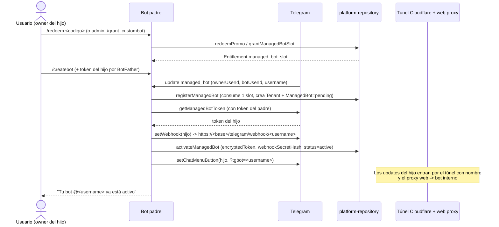

# Modryva Hub Overview

El **Modryva Hub** es la capa de plataforma tipo **GroupHelp**: un **bot padre** (el bot Modryva
principal) concede acceso a usuarios y les permite **crear y gestionar bots hijos** ("managed bots"),
cada uno con su propio token, webhook y tenant aislado. Todo se orquesta desde el mismo backend NestJS y
la misma Mini App; el bot que sirve cada petición se resuelve por [[Bot Scoping]].

## Bot padre vs. bots hijos

- **Bot padre (primary):** el bot configurado en `TELEGRAM_BOT_USERNAME`
  (`packages/shared/src/env.ts:67`, default `superbot_bot`). Su token vive en `TELEGRAM_BOT_TOKEN`. En el
  código se identifica con `primaryUsername()` (`apps/api/src/platform.controller.ts:580`) y en la BD con
  el flag `ManagedBot.isPrimary = true`. El padre es quien recibe los comandos de plataforma, concede
  accesos y activa los hijos.
- **Bots hijos (managed):** filas de [[Modelo ManagedBot]] con `isPrimary = false`, cada una con su
  `tenantId` propio (`Tenant` `telegram-<username>`), token cifrado (`encryptedToken`) y `webhookSecretHash`.
  Un hijo entra por su propio webhook `/telegram/webhook/<username>` (ver [[Webhook de Bots Hijos]]).

## Cómo se concede el acceso

El acceso a crear un bot hijo se materializa como un **[[Modelo Entitlement]]** de tipo `managed_bot_slot`.
Hay dos caminos (ambos en [[Controller platform]] y `packages/data/src/platform-repository.ts`):

1. **Código promo:** un admin crea un [[Modelo PromoCode]] (`/promo_create` o `POST /v1/platform/promos`);
   el usuario lo canjea con `/redeem <codigo>` → `redeemPromo` crea un Entitlement con `source = promo`
   (`platform-repository.ts:594`). Ver [[Promo Codes y Entitlements]].
2. **Concesión directa:** `/grant_custombot` o `POST /v1/platform/grants/custombot` →
   `grantManagedBotSlot` crea un Entitlement con `source = manual`
   (`platform-repository.ts:680`, `platform.controller.ts:378`).

Con un slot disponible, el usuario ejecuta `/createbot` y añade su token de BotFather; el padre detecta
el bot y lo activa (ver diagrama y [[Managed Bots]]).

## Roles y entitlements (resumen)

- **Roles de plataforma** ([[Enum PlatformRole]]): `platform_owner`, `promo_admin`, `bot_factory_admin`,
  `support_admin`, `auditor`. Se asignan en [[Modelo PlatformRoleAssignment]] y se comprueban en
  [[Platform Roles y RBAC]]. El owner puede venir del entorno (`SUPERBOT_OWNER_TELEGRAM_ID`) o del rol
  `platform_owner` (`platform.controller.ts:586`).
- **Entitlements**: unidad de "derecho a" ([[Modelo Entitlement]]). Hoy el único wired es
  `managed_bot_slot`; `pro_trial` y `agency_pack` están declarados pero sin uso (ver [[Enum EntitlementKind]]).

> [!warning] Dos "entitlements" distintos
> `apps/api/src/miniapp/entitlement.controller.ts` NO gestiona slots de bots: gestiona el entitlement de
> **red/federación** (plan + `maxChats` por `fedId`, modelos `OwnerNetworkEntitlement` /
> `OwnerNetworkPremiumCode`). Es un sistema aparte del `managed_bot_slot` del Hub. No confundir. Ver
> [[Promo Codes y Entitlements]].

## Alta de un bot hijo (Mermaid)

Detalle del ciclo de vida (pausa por caducidad, reactivación, cifrado de token) en [[Managed Bots]].

## Superficies del Hub

- **Bot padre (comandos):** `/createbot`, `/mybots`, `/myplan`, `/redeem`, `/platform`, `/promo_create`,
  `/promo_list`, `/promo_revoke`, `/grant_custombot`, `/revoke_custombot`, `/platform_admin`, y baneos
  globales (`/banbotuser`, `/unbanbotuser`, `/checkbotban`, `/botbans`). Parseo en
  `modules/core/src/platform.ts` y `apps/bot/src/bot-update.service.ts`.
- **Mini App `/platform`:** panel web ([[Pantalla platform]]) contra [[Controller platform]].

## Relaciones

- Pertenece a: [[Modryva Hub Map]]
- Depende de: [[Controller platform]], [[Package data]]
- Utilizado por: [[Pantalla platform]]
- Produce: [[Managed Bots]], [[Promo Codes y Entitlements]]
- Consume: [[Bot Scoping]], [[Webhook de Bots Hijos]]
- Relacionado con: [[Platform Roles y RBAC]], [[Platform User Ban]], [[Infrastructure Map]], [[Database Map]]
