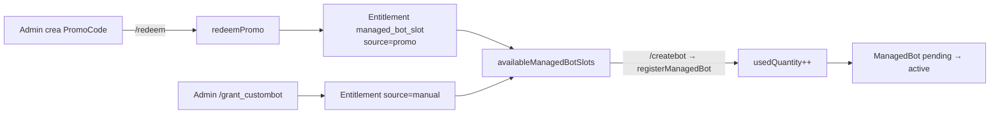

# Promo Codes y Entitlements

El sistema que convierte un **código** en un **derecho** a crear bots hijos. Cadena:
[[Modelo PromoCode]] → [[Modelo PromoRedemption]] → [[Modelo Entitlement]].

## Modelo de datos

- **PromoCode** (`schema.prisma:178`): `codeHash` (único), `codePrefix`, `kind` ([[Enum EntitlementKind]]),
  `template` ([[Enum ManagedBotTemplate]]), `quantity`, `maxUses`, `usedCount`, `expiresAt`, `revokedAt`,
  `note`. El código en claro **no** se guarda; solo su hash.
- **PromoRedemption** (`:203`): une `promoCodeId` + `redeemedByTelegramId` + `entitlementId`, con
  `@@unique([promoCodeId, redeemedByTelegramId])` → un usuario no canjea el mismo código dos veces.
- **Entitlement** (`:218`): `ownerTelegramId`, `kind`, `template`, `quantity`, `usedQuantity`, `source`
  ([[Enum EntitlementSource]]), `sourceRef`, `expiresAt`, `revokedAt`.

## Generación y hashing de códigos

- `generatePromoCode` (`platform-repository.ts:362`) → formato `SB-XXXXXX-XXXXXX-XXXXXX` (base64url upper).
- `hashPromoCode` (`:351`) = `sha256("promo:" + normalizeUpper(code))`. `createPromo` guarda `codeHash` +
  `codePrefix` (primeros 10 chars, para mostrar sin revelar).

## Creación (admin)

- **Web:** `POST /v1/platform/promos` (`platform.controller.ts:351`), rol `promo_admin`. `kind` fijo a
  `managed_bot_slot`, `quantity = 1`, `maxUses` 1–10000, `expiresInDays` opcional.
- **Bot:** `/promo_create <plantilla> [usos] [dias] [nota]` (`modules/core/src/platform.ts:186`).
- **Concesión directa** (sin código): `grantManagedBotSlot` (`:680`) crea el Entitlement con
  `source = manual` — vía `POST /v1/platform/grants/custombot` (`bot_factory_admin`) o `/grant_custombot`.

## Canje (`redeemPromo`, `:594`)

Transacción con guardas en orden: `not-found` → `revoked` → `expired` → `used-up` → `already-redeemed`.
Incrementa `usedCount` atómicamente (`updateMany ... usedCount < maxUses`), crea el Entitlement
(`source = promo`, `sourceRef = promo.id`, hereda `expiresAt` del promo) y la `PromoRedemption`. El
`@@unique` de redención + captura de `P2002` garantizan idempotencia. El bot lo llama tras `/redeem <codigo>`
(mensaje de éxito en `apps/bot/src/bot-update.service.ts:4009`).

## Contabilidad de slots

`availableManagedBotSlots(ownerTelegramId)` (`:727`) = suma de `max(0, quantity - usedQuantity)` sobre los
entitlements `managed_bot_slot` **activos** (no revocados y sin caducar — helper `isActive`, `:404`).
`registerManagedBot` incrementa `usedQuantity` al alta de un bot (ver [[Managed Bots]]);
`revokeManagedBotSlots` (`:705`) revoca todos los slots de un owner (marca `revokedAt`).

> [!warning] No confundir con el entitlement de red
> `apps/api/src/miniapp/entitlement.controller.ts` gestiona un entitlement **distinto**: el de
> **federación / red de grupos** (`plan`, `maxChats`, `premiumUntil` por `fedId`; modelos
> `OwnerNetworkEntitlement` y `OwnerNetworkPremiumCode`). Usa `PrismaEntitlementRepository` +
> `PrismaFederationRepository`, y su `generateCode` (owner-only) es para planes de red, no para slots de
> bot. Son dos economías separadas que hoy no comparten tabla. Ver [[Open Questions]].

## Relaciones

- Pertenece a: [[Modryva Hub Overview]]
- Depende de: [[Modelo PromoCode]], [[Modelo Entitlement]], [[Modelo PromoRedemption]]
- Produce: [[Managed Bots]]
- Utilizado por: [[Controller platform]], [[Pantalla platform]]
- Relacionado con: [[Enum EntitlementKind]], [[Enum EntitlementSource]], [[Modryva Hub Map]]
