# Webhook de Bots Hijos

Cómo entra un update de un **bot hijo** al backend y cómo se verifica que es legítimo. Cada bot hijo tiene
su webhook fijado en `<base>/telegram/webhook/<username>` durante la activación (ver [[Managed Bots]]).

## Camino del request

```mermaid
flowchart LR
    TG[Telegram] -->|POST /telegram/webhook/&lt;username&gt;<br/>x-telegram-bot-api-secret-token| CF[Túnel Cloudflare con nombre]
    CF --> WEB[Next.js route<br/>apps/web/app/telegram/webhook/&#91;botUsername&#93;/route.ts]
    WEB -->|proxy a BOT_INTERNAL_URL<br/>default http://bot:3002| BOT[TelegramWebhookController]
    BOT --> VER{verifyWebhookSecret}
    VER -->|false| E401[401 invalid-secret-token]
    VER -->|null → fallback primary| P[secreto del padre]
    VER -->|true| PROC[BotUpdateService.processWebhook]
```

## Proxy web → bot

`apps/web/app/telegram/webhook/[botUsername]/route.ts` reenvía el POST al contenedor del bot:
- Valida `botUsername` con `^[A-Za-z0-9_]{1,64}$` (`:14`).
- Destino: `BOT_INTERNAL_URL` (default `http://bot:3002`, `:6`).
- Propaga `x-telegram-bot-api-secret-token` y `content-type`; hace streaming del body (`duplex: "half"`).
- `502 bot-upstream-unreachable` si el bot interno no responde.

Este proxy existe porque el borde público (túnel Cloudflare / web) es lo expuesto, mientras que el bot
NestJS corre en red interna. Ver [[Infrastructure Map]].

## Verificación del secreto

`TelegramWebhookController` (`apps/bot/src/telegram-webhook.controller.ts:19`), ruta
`telegram/webhook/:botUsername`:

1. `verifyWebhookSecret(botUsername, secretToken)` (`platform-repository.ts:981`) devuelve:
   - **`null`** → el username no es un bot hijo con secreto (no existe, es `isPrimary`, o sin
     `webhookSecretHash`). Se trata como el bot **padre**.
   - **`false`** → es un hijo pero el token no casa (`hashWebhookSecret(secretToken) !== webhookSecretHash`)
     o falta el header → **401 `invalid-secret-token`**.
   - **`true`** → hijo válido, continúa.
2. Si `null` (padre): compara contra `TELEGRAM_WEBHOOK_SECRET` del entorno. En `production` sin secreto
   configurado → 401 `missing-secret-token` (fail-closed).
3. Delega en `BotUpdateService.processWebhook(botUsername, body)` — el `botUsername` selecciona el tenant
   correcto aguas abajo (ver [[Bot Scoping]]).

`hashWebhookSecret` (`platform-repository.ts:356`) = `sha256("webhook:" + secret)`; en BD solo se guarda el
hash (`ManagedBot.webhookSecretHash`), nunca el secreto en claro.

## Endpoint de simulación (dev)

`POST telegram/webhook/:botUsername/simulate` (`:72`) es un helper de dry-run que devuelve
`404 not-found` cuando `NODE_ENV === "production"`: nunca se expone en producción.

## Relaciones

- Pertenece a: [[Modryva Hub Overview]]
- Depende de: [[Package data]], [[Infrastructure Map]]
- Consume: [[Managed Bots]]
- Produce: [[Bot Scoping]]
- Relacionado con: [[Modryva Hub Map]], [[Controller platform]]
