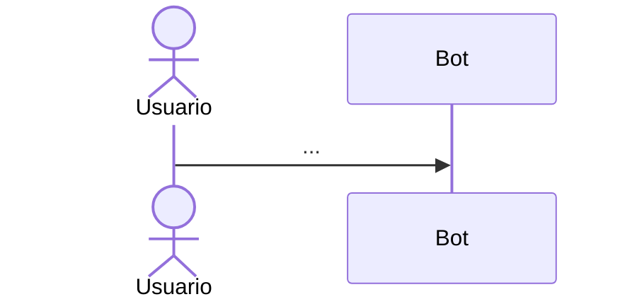

# Flujo <name>

1. **Disparador** —
2. **Precondiciones** —
3. **Actores** —
4. **Componentes implicados** — (enlaza [[...]])
5. **Secuencia de ejecución** —

6. **Persistencia** —
7. **Eventos producidos** —
8. **Errores posibles** —
9. **Seguridad** —
10. **Observabilidad** —
11. **Tests relacionados** —

## Relaciones
- Pertenece a: [[Workflows Map]]
- Depende de:
- Produce:
- Consume:
- Relacionado con:
